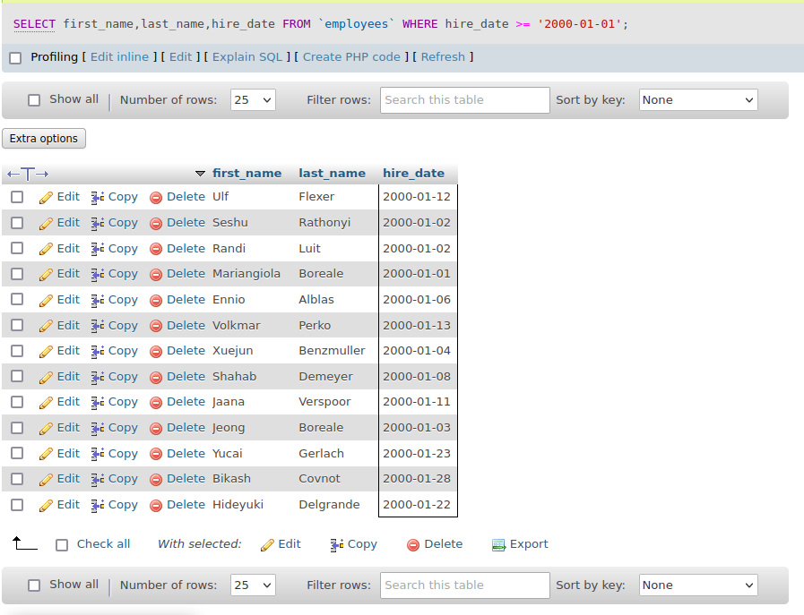
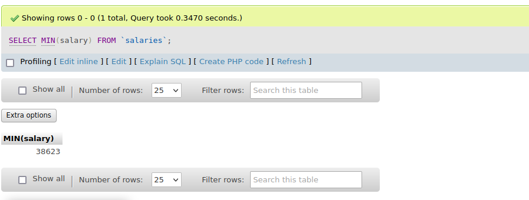
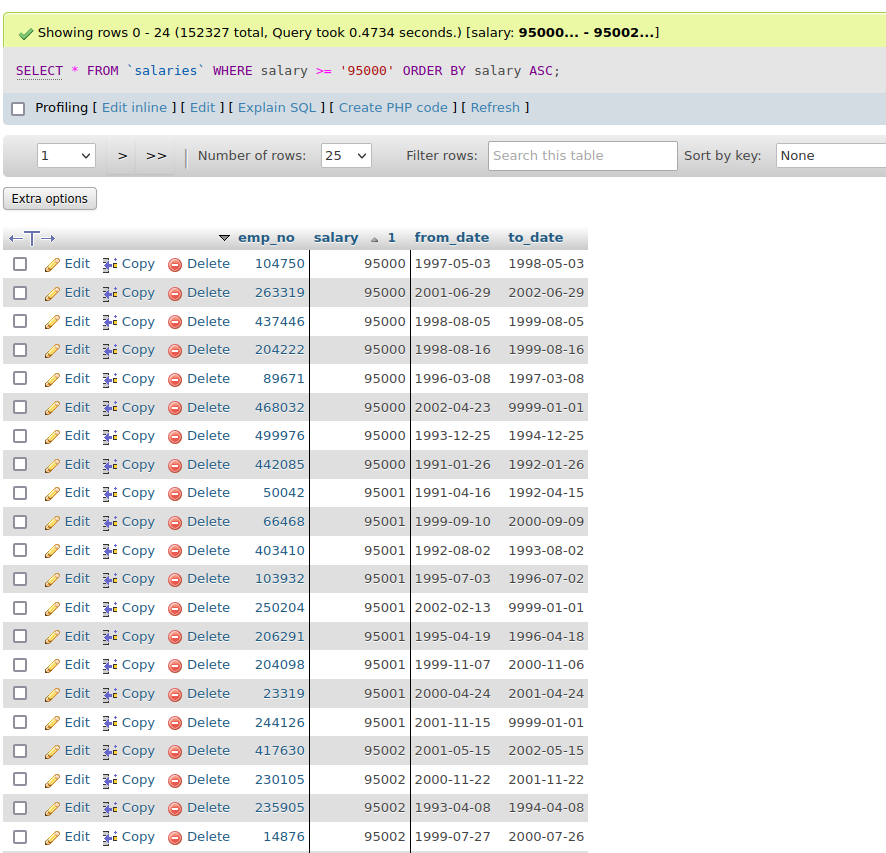
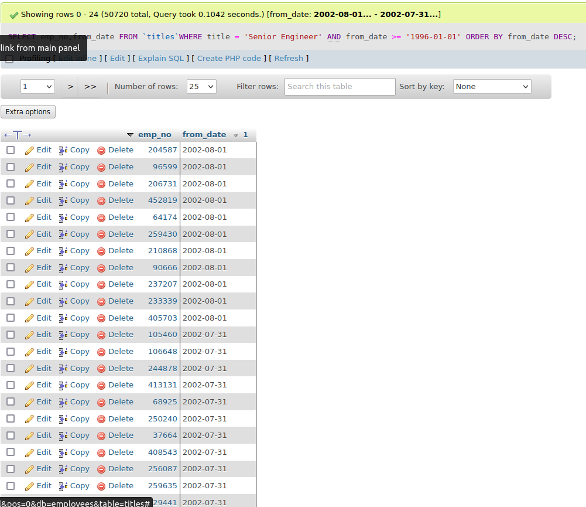
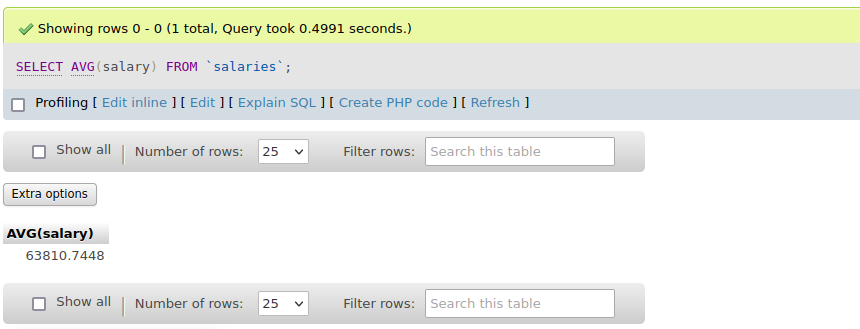
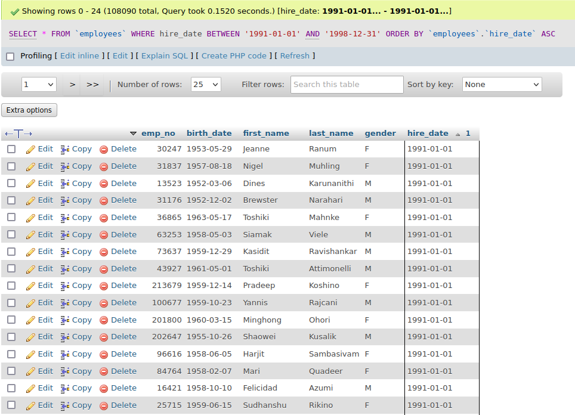
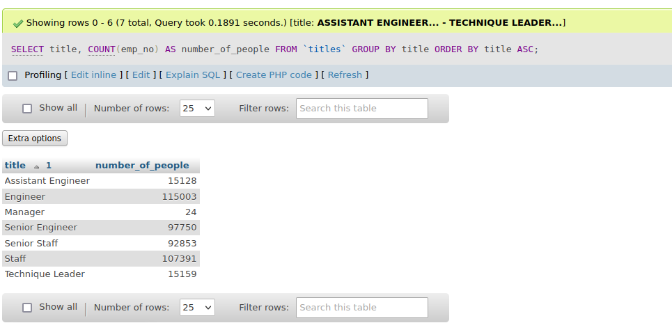

# My SQL training
### Example queries
Database source: https://github.com/datacharmer/test_db

1. pokaż pracowników zatrudnionych po 1999 roku
```sql
SELECT first_name,last_name,hire_date From employees WHERE hire_date >= '2000-01-01';
```


2. pokaż minimalne wynagrodzenie w organizacji
```sql
SELECT MIN(salary) FROM salaries;
```


3. pokaż wynagrodzenia równe lub wieksze od 95000 posortowane rosnąco
```sql
SELECT * FROM salaries WHERE salary >= '95000' ORDER BY salary ASC;
```


4. pokaż Senior Engineer zatrudnionych od 1996 roku i posortuj od najpóźniej zatrudnionych
```sql
SELECT emp_no,from_date FROM titles WHERE title = 'Senior Engineer' AND from_date >= '1996-01-01' ORDER BY from_date DESC;
```


5. pokaż średnią zarobków w organizacji
```sql
SELECT AVG(salary) FROM salaries;
```


6. pokaż osoby zatrudnione między 1991 a 1998 rokiem i posortuj rosnąco
```sql
SELECT * FROM employees WHERE hire_date BETWEEN '1991-01-01' AND '1998-12-31' ORDER BY employees . hire_date ASC;
```


7. pokaż ilość osób zatrudnionych na poszczególnych stanowiskach posortowanych alfabetycznie
```sql
SELECT title, COUNT(emp_no) AS number_of_pepole FROM titles GROUP BY title ORDER BY title ASC;
```
